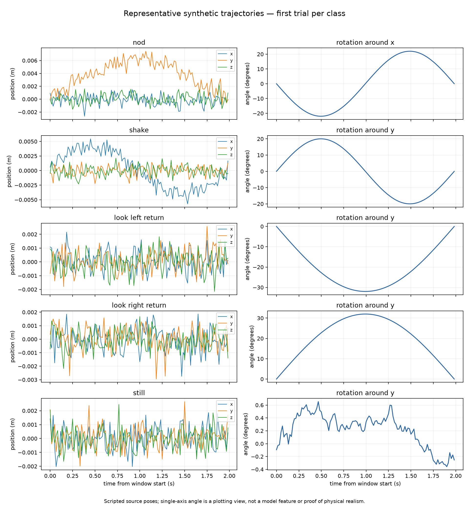
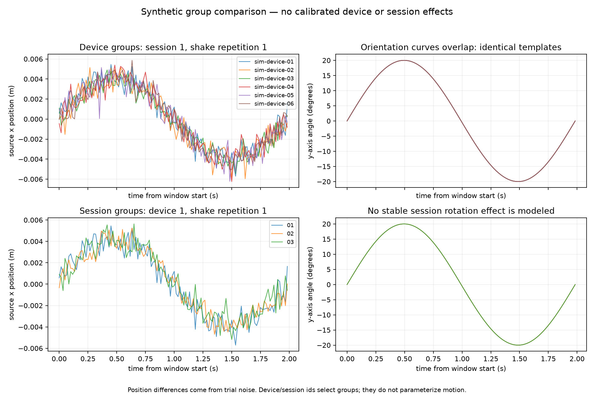

# Week 2 Synthetic Data Validation

**Configuration:** `pilot.json`  
**Schema:** `quest-window.schema.json`  
**Original run environment:** Python 3.12.7 through an MSYS-based virtual environment  
**Expanded evidence environment:** Python 3.13.14 on Windows 11

## Goal

Test whether the scripted generator creates synthetic Quest-style head-motion windows that follow our data format and cross-session split rules.

## My commands

Original run:

`python src/python/scripts/generate_data.py`

`python src/python/scripts/validate_data.py`

`python -m unittest discover -s tests -v`

The original commands were run using `.venv/bin/python.exe`.

Expanded evidence run:

`python -m pip install -e .`

`python src/python/scripts/generate_data.py`

`python src/python/scripts/validate_data.py`

`python src/python/scripts/analyze_synthetic_data.py --run-tests --machine-model "HP Pavilion Plus Laptop 16-ab1xxx"`

## Results

- Generated 1,800 synthetic windows
- Generated 120 samples per window
- Used 6 synthetic device groups and 3 sessions per device
- Used 20 trials per class in each session
- Produced 600 training, 600 validation, and 600 testing windows
- Produced 360 windows for each of the 5 motion classes
- The standalone validator completed without errors
- All 5 original automated tests passed
- Original unit-test runtime: 0.471 seconds

The 5 original tests confirmed that valid generated data passes, the generator is repeatable and balanced, and the validator catches bad quaternions, session leakage, and source-trial leakage.

## Expanded results after Week 2 feedback

The expanded evidence run used repository commit `3936cc60377368dead0bbfa692df113cb41c7798` with a clean working tree. The generated dataset SHA-256 was `0e29a1091db2a82968e75ef879934cb3164c38f4df874766f2c29c76b3231f00`.

The saved dataset exactly matched regeneration from `pilot.json` with seed 7. The expanded suite ran 21 tests in 10.381 seconds. All 21 tests passed with 0 failures, 0 errors, and 0 skipped tests.

### Class counts by device and session

| Device | Session | Split | nod | shake | look left return | look right return | still | Total |
|---|---|---|---:|---:|---:|---:|---:|---:|
| sim-device-01 | sim-device-01-session-01 | train | 20 | 20 | 20 | 20 | 20 | 100 |
| sim-device-01 | sim-device-01-session-02 | validation | 20 | 20 | 20 | 20 | 20 | 100 |
| sim-device-01 | sim-device-01-session-03 | test | 20 | 20 | 20 | 20 | 20 | 100 |
| sim-device-02 | sim-device-02-session-01 | train | 20 | 20 | 20 | 20 | 20 | 100 |
| sim-device-02 | sim-device-02-session-02 | validation | 20 | 20 | 20 | 20 | 20 | 100 |
| sim-device-02 | sim-device-02-session-03 | test | 20 | 20 | 20 | 20 | 20 | 100 |
| sim-device-03 | sim-device-03-session-01 | train | 20 | 20 | 20 | 20 | 20 | 100 |
| sim-device-03 | sim-device-03-session-02 | validation | 20 | 20 | 20 | 20 | 20 | 100 |
| sim-device-03 | sim-device-03-session-03 | test | 20 | 20 | 20 | 20 | 20 | 100 |
| sim-device-04 | sim-device-04-session-01 | train | 20 | 20 | 20 | 20 | 20 | 100 |
| sim-device-04 | sim-device-04-session-02 | validation | 20 | 20 | 20 | 20 | 20 | 100 |
| sim-device-04 | sim-device-04-session-03 | test | 20 | 20 | 20 | 20 | 20 | 100 |
| sim-device-05 | sim-device-05-session-01 | train | 20 | 20 | 20 | 20 | 20 | 100 |
| sim-device-05 | sim-device-05-session-02 | validation | 20 | 20 | 20 | 20 | 20 | 100 |
| sim-device-05 | sim-device-05-session-03 | test | 20 | 20 | 20 | 20 | 20 | 100 |
| sim-device-06 | sim-device-06-session-01 | train | 20 | 20 | 20 | 20 | 20 | 100 |
| sim-device-06 | sim-device-06-session-02 | validation | 20 | 20 | 20 | 20 | 20 | 100 |
| sim-device-06 | sim-device-06-session-03 | test | 20 | 20 | 20 | 20 | 20 | 100 |

### Data quality

| Measurement | Observed value |
|---|---:|
| Loaded windows | 1,800 |
| Saved samples | 216,000 |
| Missing saved sample slots | 0 |
| Extra saved samples | 0 |
| Invalid tracking flags | 0 |
| Windows failing individual validation | 0 |
| Dataset validation errors | 0 |
| Resampling events | 0 |

Missing saved sample slots means that a saved window contains fewer than the required 120 samples. Raw headset acquisition loss wasn't measured because this experiment didn't use a physical headset capture. The generator directly created the fixed 120-sample grid, so it didn't perform resampling.

### Split identifiers

| Split | Windows | Source trials | Trials | Sessions | Devices | Human participants |
|---|---:|---:|---:|---:|---:|---:|
| Train | 600 | 600 | 600 | 6 | 6 | 0 |
| Validation | 600 | 600 | 600 | 6 | 6 | 0 |
| Test | 600 | 600 | 600 | 6 | 6 | 0 |

| Split pair | Shared prohibited IDs | Shared device IDs | Shared profile IDs |
|---|---:|---:|---:|
| Train / validation | 0 | 6 | 6 |
| Train / test | 0 | 6 | 6 |
| Validation / test | 0 | 6 | 6 |

Window IDs, source-trial IDs, trial IDs, and complete session IDs had zero overlap between every pair of splits. Device and profile IDs overlap intentionally because the experiment uses a cross-session split. The profile ID is an alias for the synthetic device grouping ID, and there are no separate participant profiles.

### Automated tests

| Test | Purpose | Expected | Actual |
|---|---|---|---|
| Generated identifiers match records | Device, session, trial, label, source, and window IDs agree | Assertions pass | Passed |
| Generated quaternions are normalized and continuous | Every generated quaternion has unit norm and continuous signs | Assertions pass | Passed |
| Generated records pass validation | Clean records pass the schema, quality rules, and configured identifier checks | Assertions pass | Passed |
| Generated windows have 120 ordered samples | Every fixed-grid window has consecutive indexes and increasing times | Assertions pass | Passed |
| Generator is deterministic and balanced | The same seed reproduces records and balanced device-session class counts | Assertions pass | Passed |
| Generator rejects unimplemented device effects | Enabling an unsupported effect produces an error | Assertions pass | Passed |
| Schema rejects wrong types and extra fields | Schema types, required fields, enums, and extra-field rules are enforced | Assertions pass | Passed |
| Tracking threshold accepts 114 and rejects 113 | Exactly 95% valid tracking passes and a lower fraction fails | Assertions pass | Passed |
| Validator catches bad quaternion | An invalid zero quaternion is rejected | Assertions pass | Passed |
| Validator catches ID mismatch | Inconsistent device, session, and trial relationships are rejected | Assertions pass | Passed |
| Validator catches missing group | Removing a complete session is rejected | Assertions pass | Passed |
| Validator catches quaternion sign flip | An isolated equivalent quaternion sign flip is rejected | Assertions pass | Passed |
| Validator catches timestamp gap and order | Large gaps and repeated timestamps are rejected | Assertions pass | Passed |
| Validator rejects nonfinite position | NaN and infinity position values are rejected | Assertions pass | Passed |
| Validator rejects short window | A saved window with only 119 samples is rejected | Assertions pass | Passed |
| Clean dataset has no prohibited split overlap | Window, trial, source-trial, and session IDs are disjoint | Assertions pass | Passed |
| Validator catches duplicate window | Reusing a window ID is rejected | Assertions pass | Passed |
| Validator catches sequence gap | A missing sequence number is rejected | Assertions pass | Passed |
| Validator catches session split leakage | Placing part of a session in another split is rejected | Assertions pass | Passed |
| Validator catches source-trial leakage | A source-trial ID shared between training and testing is rejected | Assertions pass | Passed |
| Validator catches whole session in wrong split | Moving a complete session to the wrong configured split is rejected | Assertions pass | Passed |

### Figures





The representative trajectories show the programmed position and orientation patterns for the five classes. The device/session comparison shows that position differences come from trial noise while the orientation templates overlap. It doesn't show calibrated physical-device or session-specific effects.

### Expanded evidence files

- `keegan-evidence.json`
- `keegan-evidence.md`
- `representative-trajectories.png`
- `device-session-variability.png`
- `../../data/examples/sample-window.json`

The JSON contains the full configuration, source hashes, environment, identifier lists, overlap checks, and test transcript. The generated Markdown contains the complete evidence tables in a readable format.

## Interpretation

The generator currently produces synthetic data that follows schema v0.2 and the planned cross-session split. The results show that the implemented validation checks can catch the tested data, quality, identifier, and leakage problems.

This doesn't show that the synthetic motion matches real Quest 3 data. The class trajectories use fixed templates, stable device-specific and session-specific motion effects are disabled and unimplemented, and the small position differences in the group comparison come from trial noise. These choices can make classification artificially easy.

The 1,800 windows are synthetic windows across 6 device groups and 18 device-session groups. They aren't claimed to be statistically independent. The split demonstrates cross-session separation within the same synthetic device groups, not cross-device, cross-person, or real-Quest generalization.

## Recreate Keegan's synthetic-data baseline

From the repository root:
python -m venv .venv
.\.venv\Scripts\Activate.ps1
python -m pip install --upgrade pip
python -m pip install -e .
python src/python/scripts/generate_data.py
python src/python/scripts/validate_data.py
python src/python/scripts/analyze_synthetic_data.py --run-tests --machine-model "YOUR LAPTOP MODEL"
```

Replace the machine-model text with the actual computer model. Stop and investigate any failing command before reporting the results.
