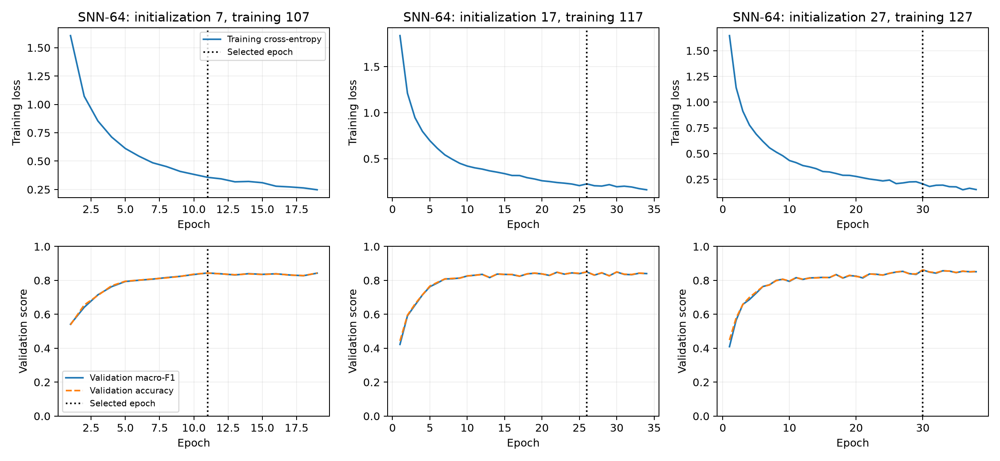
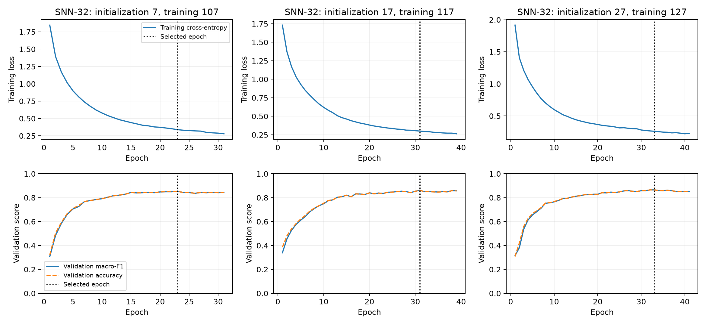

# Frozen conventional and SNN model-evidence addendum

This addendum packages existing corrected-data results. It does not retrain either SNN, choose a new architecture, replace historical results, retune an anomaly threshold or rerun authentication. Conventional storage measurements below are explicit new seed-7 reproductions, not recovered original model files.

## Current comparison and interpretation

| Model | Recorded seeds | Mean validation macro-F1 | Mean test macro-F1 | Gap below LR (percentage points) |
|---|---:|---:|---:|---:|
| logistic_regression | 5 | 0.8825 | 0.9032 | 0.00 |
| random_forest | 5 | 0.8607 | 0.8936 | 0.95 |
| snn_64 | 3 | 0.8518 | 0.8500 | 5.32 |
| snn_32 | 3 | 0.8603 | 0.8619 | 4.12 |

The predefined two-width comparison selects 32 neurons using mean Session-2 macro-F1 alone; Session-3 scores are not selection inputs. SNN-64 remains the frozen reference for the existing Tier-2 evaluation. It misses the provisional five-point tolerance (5.32-point LR gap). SNN-32 meets it (4.12-point gap), but neither SNN beats the conventional models.

The compact SNN-32 provides a viable temporal-inference baseline within the predeclared performance tolerance, but conventional models remain more accurate in this synthetic CPU evaluation. Any eventual SNN motivation must come from an independently demonstrated systems, temporal-robustness or neuromorphic-hardware advantage. Passing a project tolerance is not evidence of superiority, energy savings or deployed performance.

## Exact LIF and readout equations

Each 120-step window resets hidden membrane, previous spikes and output membrane to zero. Direct continuous input has seven pose channels; no Poisson/rate encoder or Euler conversion is used. Both widths use beta=0.9, threshold=1, surrogate slope=25, dense learned H x H recurrence including its diagonal, and no recurrent bias.

```text
a[t] = 0.9*u[t-1] + W_in*x[t] + b_in + W_rec*s[t-1]
s[t] = 1 if a[t] >= 1 else 0
u[t] = a[t] - stop_gradient(s[t])*1
surrogate d(s)/d(a) = 1 / (1 + 25*abs(a - 1))^2
v[t] = 0.9*v[t-1] + W_out*s[t] + b_out
logit[k] = (1/120)*sum_t v[t,k]
prediction = argmax_k logit[k]
```

This is subtractive reset, not reset-to-zero; readout membrane does not spike. Input 7->H has bias, recurrence H->H has none, and readout H->5 has bias. Parameter count is H^2 + 13H + 5: 4,933 for H=64 and 1,445 for H=32. PyTorch Linear reset_parameters initialization is retained. Adam uses learning rate 0.001, batch size 32, cross-entropy, gradient norm clipping at 1 and a maximum of 50 epochs. Training-only per-channel normalization uses Session 1; the conventional LR scaler instead fits each of 840 flattened features on Session 1. RF does not scale.

## Checkpoint selection and stopping

Selection uses the first epoch whose validation macro-F1 improves the previous best by more than 1e-12. Stop after eight consecutive non-improving epochs, or at epoch 50. The selected best state is restored before evaluation. Every decision below was reconstructed from and reconciled against the saved history, seed pair, configuration and summary—not guessed from the final test score.

| Model | Initialization seed | Training/shuffle seed | Selected epoch | Stopping epoch | Reason |
|---|---:|---:|---:|---:|---|
| snn_64 | 7 | 107 | 11 | 19 | no validation macro-F1 improvement > 1e-12 for 8 consecutive epochs |
| snn_64 | 17 | 117 | 26 | 34 | no validation macro-F1 improvement > 1e-12 for 8 consecutive epochs |
| snn_64 | 27 | 127 | 30 | 38 | no validation macro-F1 improvement > 1e-12 for 8 consecutive epochs |
| snn_32 | 7 | 107 | 23 | 31 | no validation macro-F1 improvement > 1e-12 for 8 consecutive epochs |
| snn_32 | 17 | 117 | 31 | 39 | no validation macro-F1 improvement > 1e-12 for 8 consecutive epochs |
| snn_32 | 27 | 127 | 33 | 41 | no validation macro-F1 improvement > 1e-12 for 8 consecutive epochs |





The historical training routine saved training cross-entropy and validation accuracy/macro-F1, not validation loss or training accuracy. The plots identify those distinct units on separate axes; missing historical measurements are not invented.

## Parameters and serialized model storage

| Model | Seed | Learned coefficients | Trees / nodes / leaves | Artifact bytes | Format and scope |
|---|---:|---:|---|---:|---|
| snn_64 | 7 | 4933 | N/A | 22981 | torch.save state_dict plus seed/model metadata; scaler separate |
| snn_64 | 17 | 4933 | N/A | 22981 | torch.save state_dict plus seed/model metadata; scaler separate |
| snn_64 | 27 | 4933 | N/A | 22981 | torch.save state_dict plus seed/model metadata; scaler separate |
| snn_32 | 7 | 1445 | N/A | 9029 | torch.save state_dict plus seed/model metadata; scaler separate |
| snn_32 | 17 | 1445 | N/A | 9029 | torch.save state_dict plus seed/model metadata; scaler separate |
| snn_32 | 27 | 1445 | N/A | 9029 | torch.save state_dict plus seed/model metadata; scaler separate |
| logistic_regression | 7 | 4205 | N/A | 55441 | joblib compress=0 protocol=5; LR scaler embedded / RF no scaler |
| random_forest | 7 | N/A | 300 / 37410 / 18855 | 4019633 | joblib compress=0 protocol=5; LR scaler embedded / RF no scaler |

LR has 4,205 coefficients/intercepts; scaler statistics are not trainable coefficients. Tree counts are structure, not a neural-parameter equivalent. SNN bytes measure the exact hash-verified existing torch.save checkpoint containing state_dict and seed/model metadata, not an optimizer checkpoint. Its normalization JSON is a separate sidecar, whose byte count/hash is recorded in model-storage.csv. LR's uncompressed joblib pipeline includes its fitted StandardScaler; RF has no scaler. Different serialization formats/dtypes/metadata make these artifact sizes a storage comparison, not a fair runtime-memory, energy or hardware-efficiency claim.

The original conventional fits were not serialized. This addendum refits only the predefined seed-7 LR and 300-tree RF recipes on the original Session-1 rows, with no hyperparameter search. Before writing either model, its Session-2/Session-3 confusion counts and parameter/tree/node/leaf counts must match the frozen seed-7 results exactly. Test data is used only as a reproduction assertion, not a tuning criterion; a mismatch stops the run. New joblib files use compress=0 and pickle protocol=5, stay under Git-ignored models/, and have byte sizes and hashes in the manifest. They are explicitly new storage reproductions; equality of aggregate counts does not prove recovery of original learned weights. No SNN state is loaded or retrained here.

## Randomness and further-selection protocol

Generation seed 7 determines the one frozen synthetic dataset. Session-index splits have no RNG. LR lbfgs is deterministic on these fixed data, and its random_state labels do not produce independent randomized model replications: identical five-seed macro-F1 values give 0.0000 descriptive SD. RF seeds control fitting randomness, and SNN initialization seeds 7/17/27 are paired with training/shuffle seeds 107/117/127. All seeds still reuse the same 600 test windows, not independent datasets or human recordings. Any pooled confusion matrix repeats those same sources and is labeled accordingly.

Freeze the current classifiers, widths and anomaly thresholds. No further SNN architecture expansion until the end-to-end authentication experiment is complete. For an authorized later change: record the research question, finite candidate list, fixed data/configuration and seed roles before fitting; fit on Session 1; use mean Session-2 macro-F1 across the fixed three seed pairs to choose the candidate, with the smaller model as a tie-break; do not inspect Session-3 scores to revise candidates, stopping rules or thresholds. Previously inspected Session 3 is not a fresh holdout for an open-ended future search—an independent final evaluation requires a separately specified untouched dataset. This addendum initiates no such search.

## Complete test per-class and confusion evidence

Class order is nod, shake, look_left_return, look_right_return, still. Rows are true classes and columns predicted classes. Each seed has 600 held-out windows, 120 per class. All 32 validation/test matrices and all 160 per-class rows are also saved in machine-readable artifacts.

### logistic_regression, seed 7

| Class | Precision | Recall | F1 | Support |
|---|---:|---:|---:|---:|
| nod | 0.9174 | 0.9250 | 0.9212 | 120 |
| shake | 0.9123 | 0.8667 | 0.8889 | 120 |
| look_left_return | 0.9658 | 0.9417 | 0.9536 | 120 |
| look_right_return | 0.9732 | 0.9083 | 0.9397 | 120 |
| still | 0.7647 | 0.8667 | 0.8125 | 120 |

```text
[111, 3, 1, 0, 5]
[3, 104, 1, 2, 10]
[0, 0, 113, 0, 7]
[0, 1, 0, 109, 10]
[7, 6, 2, 1, 104]
```

### random_forest, seed 7

| Class | Precision | Recall | F1 | Support |
|---|---:|---:|---:|---:|
| nod | 0.9099 | 0.8417 | 0.8745 | 120 |
| shake | 0.9304 | 0.8917 | 0.9106 | 120 |
| look_left_return | 0.9355 | 0.9667 | 0.9508 | 120 |
| look_right_return | 0.9083 | 0.9083 | 0.9083 | 120 |
| still | 0.8000 | 0.8667 | 0.8320 | 120 |

```text
[101, 2, 3, 2, 12]
[1, 107, 0, 6, 6]
[2, 0, 116, 0, 2]
[0, 5, 0, 109, 6]
[7, 1, 5, 3, 104]
```

### logistic_regression, seed 17

| Class | Precision | Recall | F1 | Support |
|---|---:|---:|---:|---:|
| nod | 0.9174 | 0.9250 | 0.9212 | 120 |
| shake | 0.9123 | 0.8667 | 0.8889 | 120 |
| look_left_return | 0.9658 | 0.9417 | 0.9536 | 120 |
| look_right_return | 0.9732 | 0.9083 | 0.9397 | 120 |
| still | 0.7647 | 0.8667 | 0.8125 | 120 |

```text
[111, 3, 1, 0, 5]
[3, 104, 1, 2, 10]
[0, 0, 113, 0, 7]
[0, 1, 0, 109, 10]
[7, 6, 2, 1, 104]
```

### random_forest, seed 17

| Class | Precision | Recall | F1 | Support |
|---|---:|---:|---:|---:|
| nod | 0.9182 | 0.8417 | 0.8783 | 120 |
| shake | 0.9167 | 0.9167 | 0.9167 | 120 |
| look_left_return | 0.9355 | 0.9667 | 0.9508 | 120 |
| look_right_return | 0.9244 | 0.9167 | 0.9205 | 120 |
| still | 0.7953 | 0.8417 | 0.8178 | 120 |

```text
[101, 2, 3, 2, 12]
[0, 110, 0, 5, 5]
[1, 0, 116, 0, 3]
[0, 4, 0, 110, 6]
[8, 4, 5, 2, 101]
```

### logistic_regression, seed 27

| Class | Precision | Recall | F1 | Support |
|---|---:|---:|---:|---:|
| nod | 0.9174 | 0.9250 | 0.9212 | 120 |
| shake | 0.9123 | 0.8667 | 0.8889 | 120 |
| look_left_return | 0.9658 | 0.9417 | 0.9536 | 120 |
| look_right_return | 0.9732 | 0.9083 | 0.9397 | 120 |
| still | 0.7647 | 0.8667 | 0.8125 | 120 |

```text
[111, 3, 1, 0, 5]
[3, 104, 1, 2, 10]
[0, 0, 113, 0, 7]
[0, 1, 0, 109, 10]
[7, 6, 2, 1, 104]
```

### random_forest, seed 27

| Class | Precision | Recall | F1 | Support |
|---|---:|---:|---:|---:|
| nod | 0.9167 | 0.8250 | 0.8684 | 120 |
| shake | 0.9224 | 0.8917 | 0.9068 | 120 |
| look_left_return | 0.9355 | 0.9667 | 0.9508 | 120 |
| look_right_return | 0.9068 | 0.8917 | 0.8992 | 120 |
| still | 0.7761 | 0.8667 | 0.8189 | 120 |

```text
[99, 2, 3, 2, 14]
[0, 107, 0, 7, 6]
[1, 0, 116, 0, 3]
[1, 5, 0, 107, 7]
[7, 2, 5, 2, 104]
```

### logistic_regression, seed 37

| Class | Precision | Recall | F1 | Support |
|---|---:|---:|---:|---:|
| nod | 0.9174 | 0.9250 | 0.9212 | 120 |
| shake | 0.9123 | 0.8667 | 0.8889 | 120 |
| look_left_return | 0.9658 | 0.9417 | 0.9536 | 120 |
| look_right_return | 0.9732 | 0.9083 | 0.9397 | 120 |
| still | 0.7647 | 0.8667 | 0.8125 | 120 |

```text
[111, 3, 1, 0, 5]
[3, 104, 1, 2, 10]
[0, 0, 113, 0, 7]
[0, 1, 0, 109, 10]
[7, 6, 2, 1, 104]
```

### random_forest, seed 37

| Class | Precision | Recall | F1 | Support |
|---|---:|---:|---:|---:|
| nod | 0.9167 | 0.8250 | 0.8684 | 120 |
| shake | 0.9076 | 0.9000 | 0.9038 | 120 |
| look_left_return | 0.9355 | 0.9667 | 0.9508 | 120 |
| look_right_return | 0.9083 | 0.9083 | 0.9083 | 120 |
| still | 0.7984 | 0.8583 | 0.8273 | 120 |

```text
[99, 2, 4, 2, 13]
[0, 108, 0, 7, 5]
[2, 0, 116, 0, 2]
[0, 5, 0, 109, 6]
[7, 4, 4, 2, 103]
```

### logistic_regression, seed 47

| Class | Precision | Recall | F1 | Support |
|---|---:|---:|---:|---:|
| nod | 0.9174 | 0.9250 | 0.9212 | 120 |
| shake | 0.9123 | 0.8667 | 0.8889 | 120 |
| look_left_return | 0.9658 | 0.9417 | 0.9536 | 120 |
| look_right_return | 0.9732 | 0.9083 | 0.9397 | 120 |
| still | 0.7647 | 0.8667 | 0.8125 | 120 |

```text
[111, 3, 1, 0, 5]
[3, 104, 1, 2, 10]
[0, 0, 113, 0, 7]
[0, 1, 0, 109, 10]
[7, 6, 2, 1, 104]
```

### random_forest, seed 47

| Class | Precision | Recall | F1 | Support |
|---|---:|---:|---:|---:|
| nod | 0.9167 | 0.8250 | 0.8684 | 120 |
| shake | 0.9231 | 0.9000 | 0.9114 | 120 |
| look_left_return | 0.9508 | 0.9667 | 0.9587 | 120 |
| look_right_return | 0.9153 | 0.9000 | 0.9076 | 120 |
| still | 0.7852 | 0.8833 | 0.8314 | 120 |

```text
[99, 2, 3, 2, 14]
[0, 108, 0, 6, 6]
[2, 0, 116, 0, 2]
[1, 4, 0, 108, 7]
[6, 3, 3, 2, 106]
```

### snn_64, seed 7

| Class | Precision | Recall | F1 | Support |
|---|---:|---:|---:|---:|
| nod | 0.9091 | 0.8333 | 0.8696 | 120 |
| shake | 0.8173 | 0.7083 | 0.7589 | 120 |
| look_left_return | 0.8504 | 0.9000 | 0.8745 | 120 |
| look_right_return | 0.8947 | 0.8500 | 0.8718 | 120 |
| still | 0.6966 | 0.8417 | 0.7623 | 120 |

```text
[100, 0, 1, 0, 19]
[2, 85, 10, 7, 16]
[3, 6, 108, 0, 3]
[0, 12, 0, 102, 6]
[5, 1, 8, 5, 101]
```

### snn_64, seed 17

| Class | Precision | Recall | F1 | Support |
|---|---:|---:|---:|---:|
| nod | 0.9091 | 0.8333 | 0.8696 | 120 |
| shake | 0.9474 | 0.7500 | 0.8372 | 120 |
| look_left_return | 0.8692 | 0.9417 | 0.9040 | 120 |
| look_right_return | 0.8594 | 0.9167 | 0.8871 | 120 |
| still | 0.7299 | 0.8333 | 0.7782 | 120 |

```text
[100, 1, 2, 1, 16]
[2, 90, 3, 12, 13]
[2, 2, 113, 0, 3]
[3, 2, 0, 110, 5]
[3, 0, 12, 5, 100]
```

### snn_64, seed 27

| Class | Precision | Recall | F1 | Support |
|---|---:|---:|---:|---:|
| nod | 0.8966 | 0.8667 | 0.8814 | 120 |
| shake | 0.8644 | 0.8500 | 0.8571 | 120 |
| look_left_return | 0.9256 | 0.9333 | 0.9295 | 120 |
| look_right_return | 0.9068 | 0.8917 | 0.8992 | 120 |
| still | 0.7480 | 0.7917 | 0.7692 | 120 |

```text
[104, 0, 0, 0, 16]
[2, 102, 3, 6, 7]
[1, 2, 112, 0, 5]
[1, 8, 0, 107, 4]
[8, 6, 6, 5, 95]
```

### snn_32, seed 7

| Class | Precision | Recall | F1 | Support |
|---|---:|---:|---:|---:|
| nod | 0.9043 | 0.8667 | 0.8851 | 120 |
| shake | 0.8654 | 0.7500 | 0.8036 | 120 |
| look_left_return | 0.9167 | 0.9167 | 0.9167 | 120 |
| look_right_return | 0.9008 | 0.9083 | 0.9046 | 120 |
| still | 0.7571 | 0.8833 | 0.8154 | 120 |

```text
[104, 1, 2, 0, 13]
[3, 90, 4, 10, 13]
[1, 6, 110, 0, 3]
[1, 5, 0, 109, 5]
[6, 2, 4, 2, 106]
```

### snn_32, seed 17

| Class | Precision | Recall | F1 | Support |
|---|---:|---:|---:|---:|
| nod | 0.9009 | 0.8333 | 0.8658 | 120 |
| shake | 0.9126 | 0.7833 | 0.8430 | 120 |
| look_left_return | 0.9256 | 0.9333 | 0.9295 | 120 |
| look_right_return | 0.8934 | 0.9083 | 0.9008 | 120 |
| still | 0.7273 | 0.8667 | 0.7909 | 120 |

```text
[100, 1, 3, 1, 15]
[0, 94, 3, 8, 15]
[3, 3, 112, 0, 2]
[1, 3, 0, 109, 7]
[7, 2, 3, 4, 104]
```

### snn_32, seed 27

| Class | Precision | Recall | F1 | Support |
|---|---:|---:|---:|---:|
| nod | 0.9434 | 0.8333 | 0.8850 | 120 |
| shake | 0.8421 | 0.8000 | 0.8205 | 120 |
| look_left_return | 0.9113 | 0.9417 | 0.9262 | 120 |
| look_right_return | 0.8917 | 0.8917 | 0.8917 | 120 |
| still | 0.7059 | 0.8000 | 0.7500 | 120 |

```text
[100, 1, 1, 0, 18]
[1, 96, 4, 8, 11]
[1, 3, 113, 0, 3]
[0, 5, 0, 107, 8]
[4, 9, 6, 5, 96]
```

## Scope

Cross-session synthetic evaluation with six fixed simulated device profiles only. No cross-device, cross-person, headset or real-world transfer claim follows. Existing leakage results and Week 4/Tier-2 runs remain unchanged. This report is not fresh end-to-end timing, reconstruction availability or security-rate evidence.
